# Contract

- Address: KT1TZTkhnZFPL7cdNaif9B3r5oQswM1pnCXB
- [Link to contract](https://better-call.dev/ghostnet/KT1TZTkhnZFPL7cdNaif9B3r5oQswM1pnCXB/operations)
- The contract only has the operations described next, so it is easy to check them all

# Some clarifications

Test cases 4, 5, 10 and 11 can not be done because you can only swap within the range the price is currently at. The swap only goes to other ranges if the current range runs out of either Y token or X token.

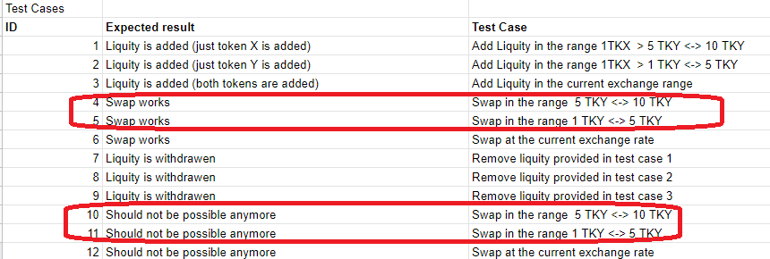

The title of each test will have its ID.

  

# Origination with initial value of P=Y/X=5

- Operation hash: oo3YisFTGrhgP9vBD1p3Eafgv2SiQduxwhiP1A5kn8on3qrzs1j
- [Link to operation](https://better-call.dev/ghostnet/opg/oo3YisFTGrhgP9vBD1p3Eafgv2SiQduxwhiP1A5kn8on3qrzs1j/contents)

  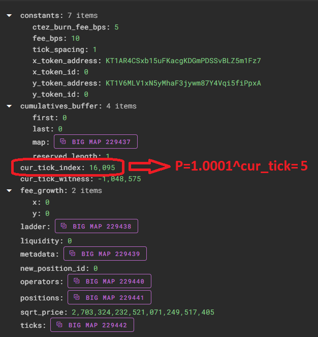
  

# ID 1) Set position in a range above the current price range

- Operation hash: ooCoVPMHErZBxvfwmLKJm7tBY44GnzLXRzs29yLY22XwGd8Q5oA
- [Link to operation](https://better-call.dev/ghostnet/opg/ooCoVPMHErZBxvfwmLKJm7tBY44GnzLXRzs29yLY22XwGd8Q5oA/contents)
- We chose the range to be between P=5.1 and P=10
- Only x tokens should be sent to the contract

  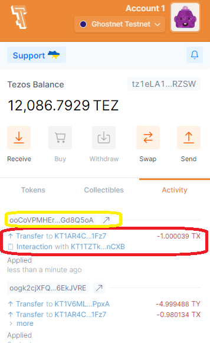
  

# ID 2) Set position in a range bellow the current price range

- Operation hash: opQzcLaUvM2HfLHc51yCX49jCJtH5fsJRFD4TL9QVLGG69yHzog
- [Link to operation](https://better-call.dev/ghostnet/opg/opQzcLaUvM2HfLHc51yCX49jCJtH5fsJRFD4TL9QVLGG69yHzog/contents)
- We chose the range to be between P=4.9 and P=1
- Only y tokens should be sent to the contract

  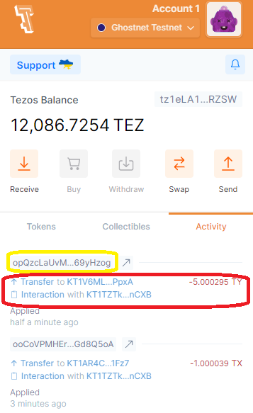
  

# ID 3) Set position in the current price range

- Operation hash: oogk2cjXFQb2iVhH8L8FDdev55VxD47zgSsh6W4huTBV6EkJVRE
- [Link to operation](https://better-call.dev/ghostnet/opg/oogk2cjXFQb2iVhH8L8FDdev55VxD47zgSsh6W4huTBV6EkJVRE/contents)
- We chose the range to be between P=5.1 and P=4.9 (it could be any range that includes the current price)
- Both x and y tokens should be sent to the contract

  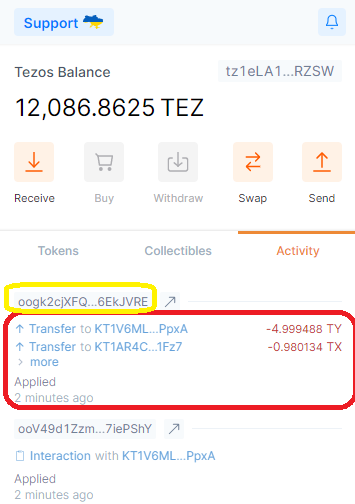
  

# ID 6) X to Y swap

- Operation hash: ooEebpZWbvy5bvJTw1VArSp22FBK9CYDucUMWqaTx3azuvnbMC2
- [Link to operation](https://better-call.dev/ghostnet/opg/ooEebpZWbvy5bvJTw1VArSp22FBK9CYDucUMWqaTx3azuvnbMC2/contents)
- We gave 0.001 X tokens to the pool, and expect to get close to Px0.001=5x0.001=0.005 y tokens
- We chose this amounts and not 1 x token, in order to not change the price too much and stay in the current price range (while showing that the exchange rate is correct). This allows to easeally do the opposite swap (as we will see next)

  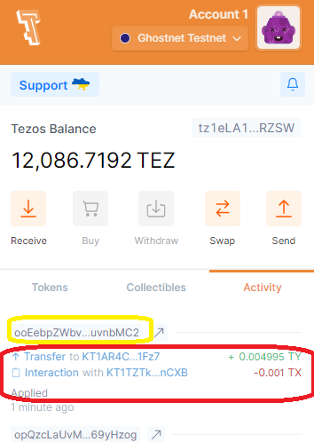
  

# ID 6) Y to X swap

- Operation hash: ooDcgaM9K8qWb8ZqyXitfhL1gMGSYt5ac9324iFwbXwQzVu7bgD
- [Link to operation](https://better-call.dev/ghostnet/opg/ooDcgaM9K8qWb8ZqyXitfhL1gMGSYt5ac9324iFwbXwQzVu7bgD/contents)
- We gave 0.005 Y tokens to the pool, and expect to get close to 0.005/P=0.005/5=0.001 x tokens

  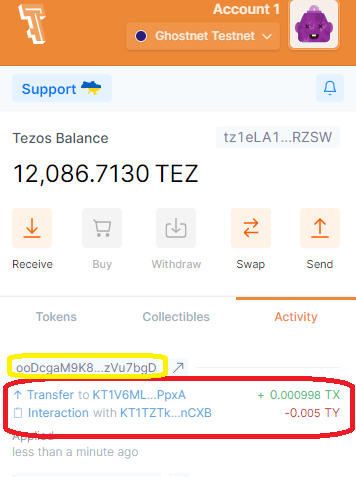
  

# ID 9) Remove position

- Operation hash: ooQEtCBZM5K7uJN25tJV2x4nFoqCusG4CwLnmT4SRqq7xknvvam
- [Link to operation](https://better-call.dev/ghostnet/opg/ooQEtCBZM5K7uJN25tJV2x4nFoqCusG4CwLnmT4SRqq7xknvvam/contents)
- We removed the initial position (the one where the current price is)
- Received our tokens back plus some fees from the swaps that occured

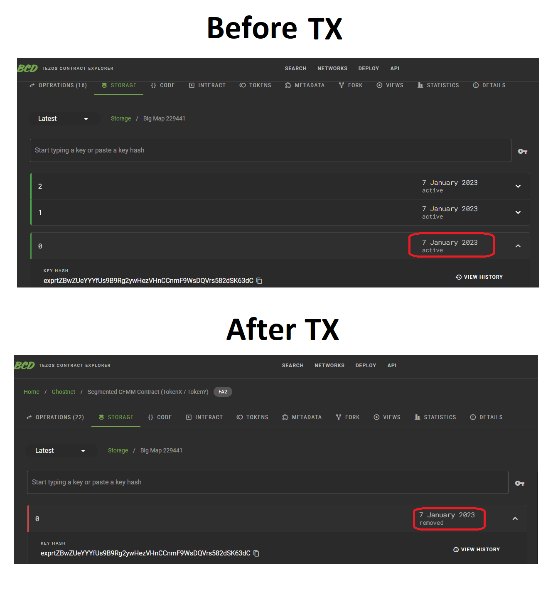

Being the tx:

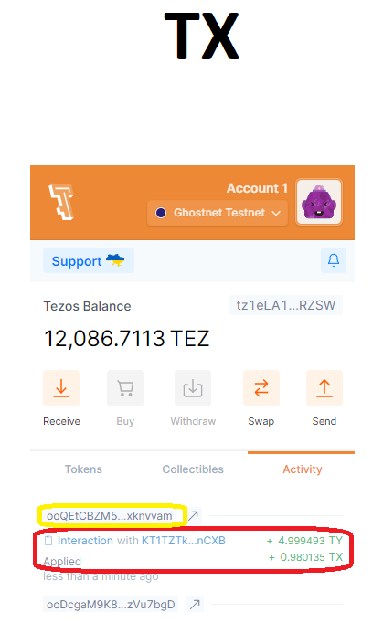

# ID 12) Attempt to swap

- Since we removed our initial position (the only one which included the current price), there is no more liquidity at the current price, so we can't preform a swap anymore

  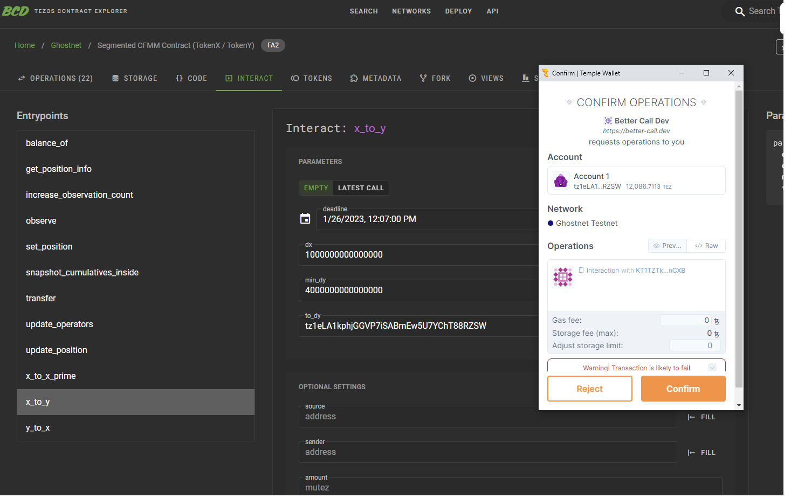

  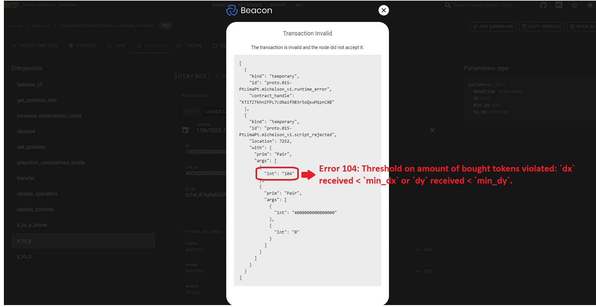

  

# Question: Does yield farming already works? If i swap in a range will the provider receive a share?

Yes, and yes. We can see that the token amounts we get from closing our position is higher than what we inputed.

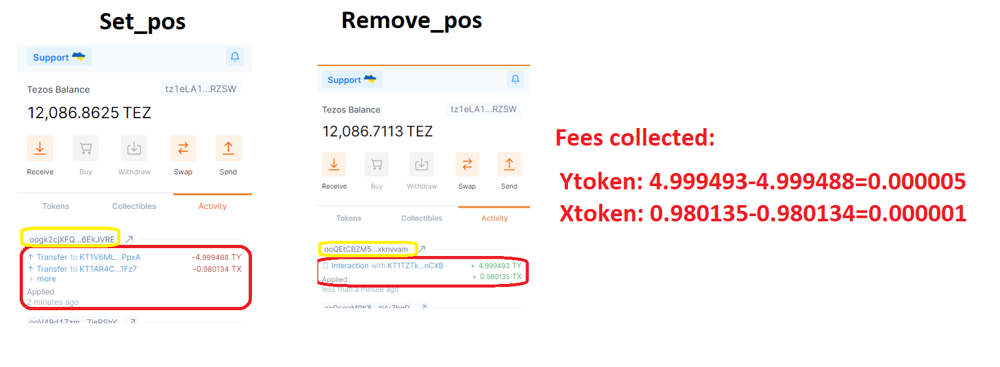
