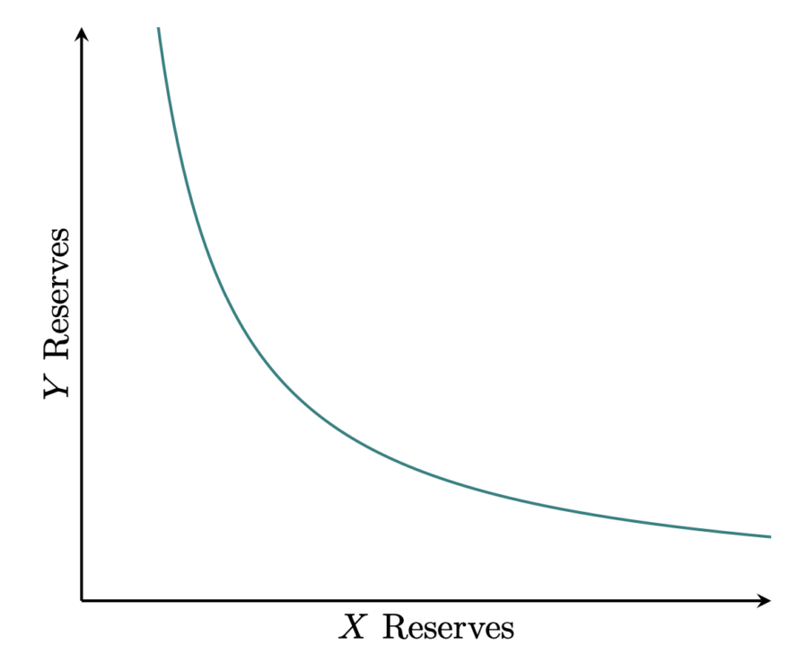
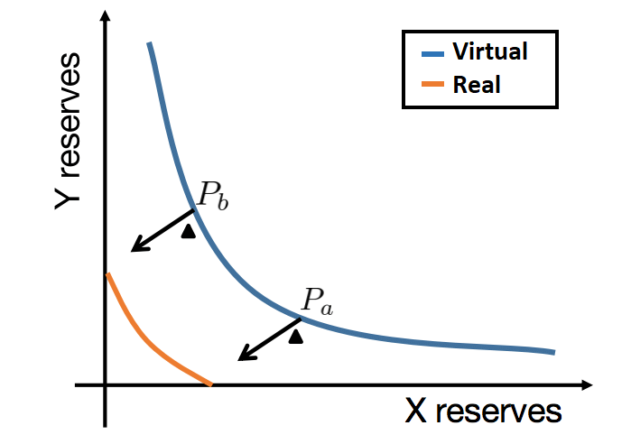
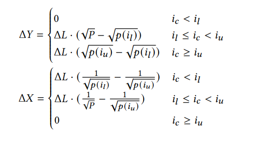
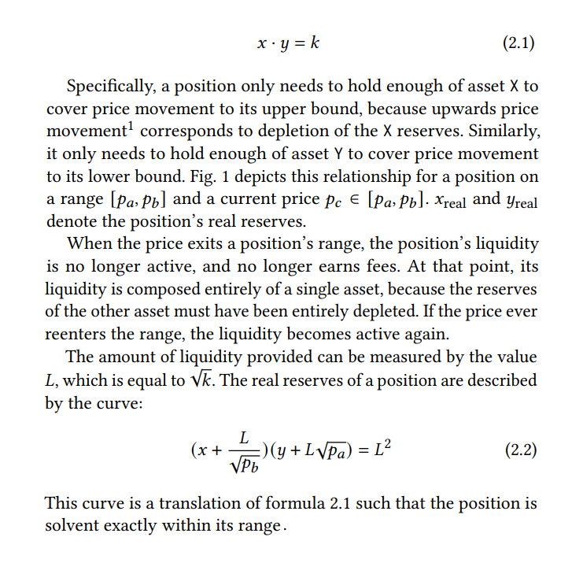
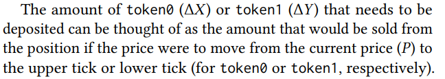
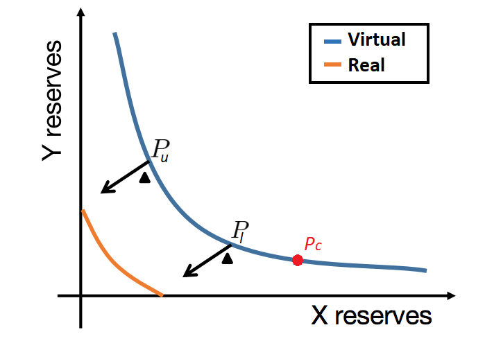
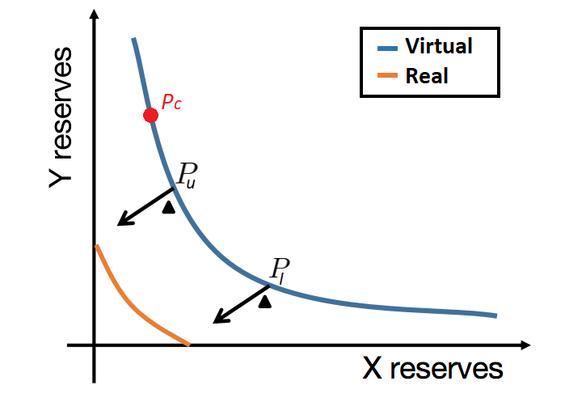
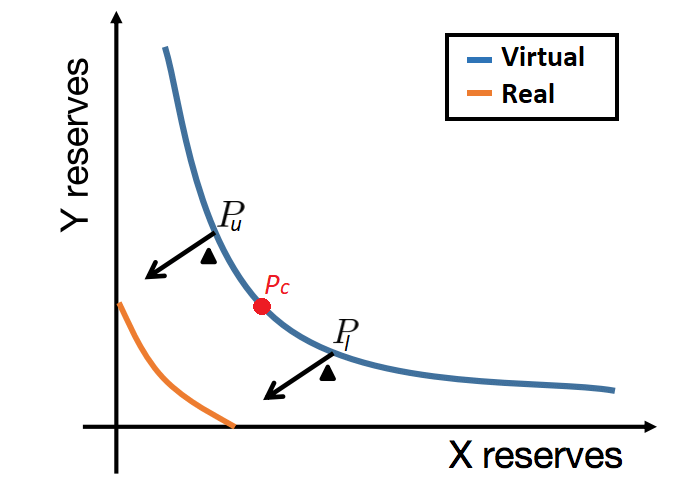

# Intro

Because V3 introduces the concept of virtual and real liquidities, the setting of positions (adding liquidity) has multiple case scenarios. These scenarios depend on where the current price, **Pc**, is (which will determine the current tick, **ic**). A tick is a simple marker of price division. For example, when we initiate a pool of X/Y, we can divide the pool in various fractions named ticks. This way the users can add liquidity between the different fractions that correspond to a certain price (in this case we consider the price to be the price ot TokenX in terms of TokenY):

The relation between tick and pricing is not really important at the moment, what is important is understanding that the price (and as a result the tick) that the contract is currently on changes and the different scenarios that can occur when adding liquidity to a pool, and how these scenarios are related to the current tick/price within the contract.

## Virtual vs Real liquidity

In uniswap V2, all liquidity is added to the whole pool. For example, if we add to a pool of X/Y, our liquidity will be used if the price of X and Y is between 0 and infinity. This makes it so the liquidity curve always follows x\*y=k, and that the liquidity is distributed equally between all prices.

 

 

However, this is not the case in V3. In V3 you can add liquidity to specific price ranges. For example, I can add liquidity for X prices between 1200 and 1600, or for Y between 10k and 50k.

So in practice, between each price range, we will have different k to satisfy x\*y=k. This makes it so the liquidity curve is not uniform. The whole pool is then represented with a virtual liquidity curve, but the real curve used is the one in the price range we are currently in.

 

 
 

## Scenarios

So, when we are setting a new position, we can have 3 different situations depending on where the price/tick of the pool is currently at, **Pc and ic**, and what are the upper and lower prices, , **Pu and Pl** (and ticks, **iu and il**) in which we want to set a new position. This is shown in this highlighted section of the Uniswap V3 whitepaper:

 

 

The unusual scenarios (ic < il or ic>=iu) are harder to understand because they are incomprehensible from a V2/normal AMM perspective. To help understand these cases, we can review two very important parts of the whitepaper. Lets call them Rule 1 and 2 for further reference:

|  |
| :-------------------: |
|       _Rule 1_        |

And add an also very important part provided at the end of the whitepaper:
|  |
|:--:|
| _Rule 2_ |

While reading the scenarios, please refer back to these rules, and keep in mind equation _2.2_. All of this will be extremely relevant.
 
 

## Scenario 1: Current price(and tick) is under the lower tick of the new position being set (ic<il)

 

 

In this case, we can see that the real reserves of token Y are zero for the current price of TokenX relative to TokenY (Pc).

So if we revisit rule 2 and focus on TokenX. The rule tells us that the amount to be deposited is the amount of tokens that would need to be sold if we want to move from the current price, Pc, to the upper price, Pu. Since the position has no Y tokens in the current price, no Y tokens would be sold, and so no Y tokens will be deposited in this case.

 
 

## Scenario 2: Current price(and tick) is over the upper tick of the new position being set (ic>=iu)

 

 

In this case, we can see that the real reserves of token X are zero for the current price of TokenX relative to TokenY (Pc).

If we again apply the thinking of Rule 2, then the amount of tokenX to be sold would be zero because there are none in the current position, so we will deposit 0 x tokens.

 
 

## Scenario 3: Current price(and tick) is between the upper and lower ticks of the new position being set

 

 
In this case, setting a position will require a transfer of both Y and X tokens.

## Conclusion

If one of the tokens is not being transferred, it simply means that we need to add liquidity to other positions in the curve, according to the rules previously specified.

The current tick the contract is in, can be seen in its storage under the name **cur_tick_index**. Simply check it and add liquidity as needed (see the first image in the Scenarios section).
